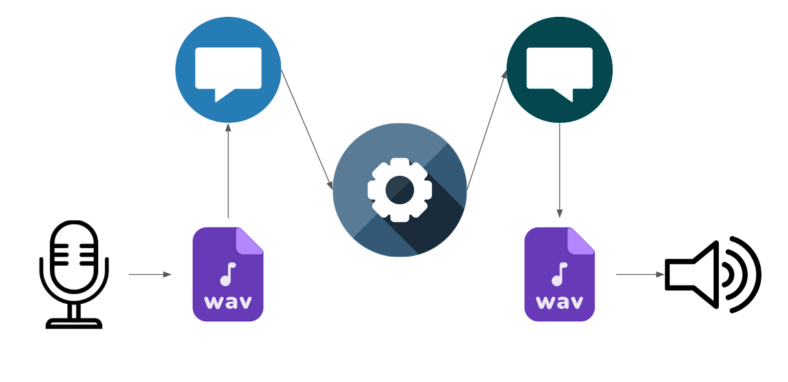
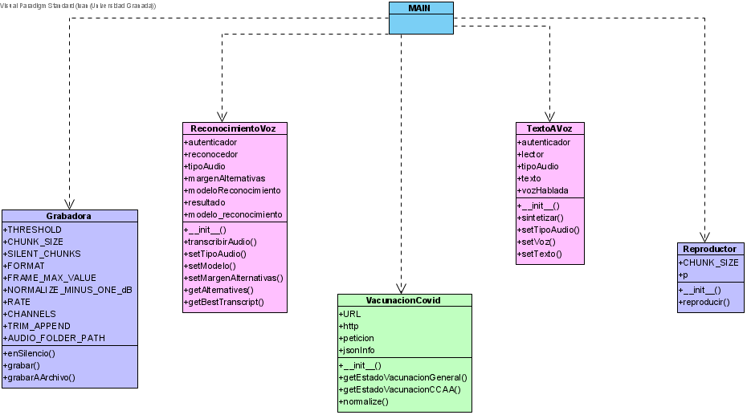
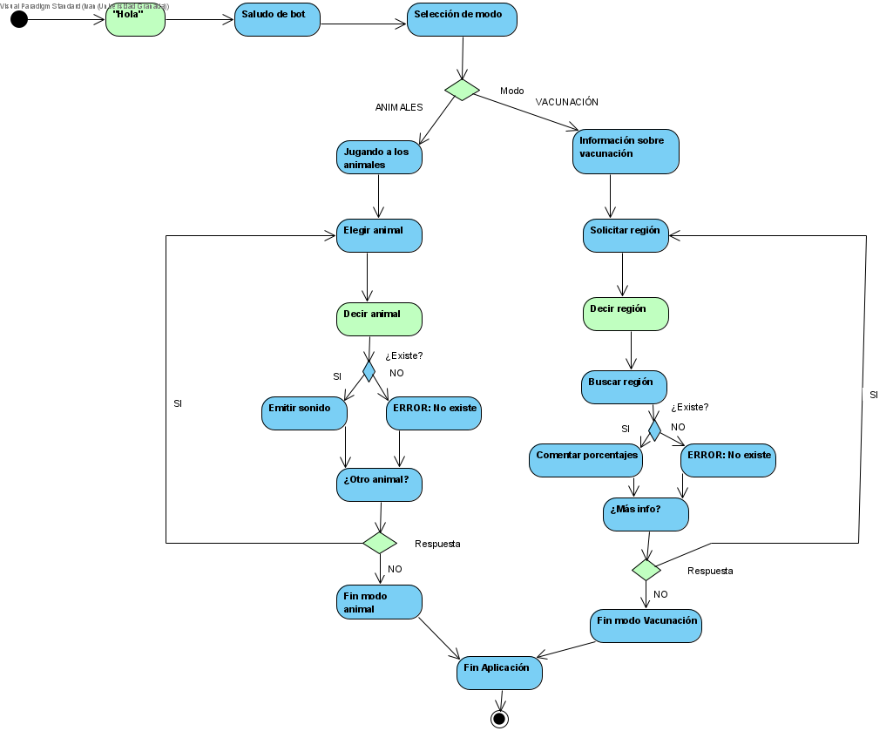
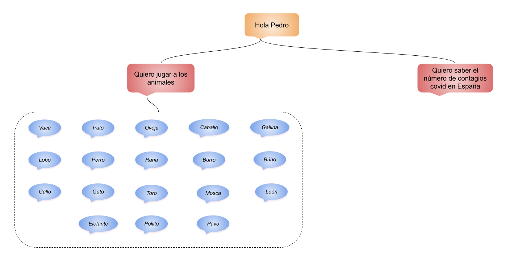

# Proyecto final: Reconocimiento de voz, Text to Speech y asistentes virtuales

Proyecto final de libre elección para la asignatura. Se ha realizado junto con Iván Valero Rodríguez.

## 0. Una idea intuitiva de los asistentes virtuales
A la hora de pensar en los asistentes virtuales lo primero que dicen es "¿Qué es eso? ¿Eso del Siri, la Cortana?" Pero puede parecer una caja negra. Una aplicación o aparato a la que le hablas, esperas un poco y te dice algo.

Podríamos, si pensamos un poco más, que las acciones que realiza son:
- Grabar un audio a través del micrófono. Eso sí, no hay que darle a ningún botón para ello, normalmente se mira el ruido ambiente y si se acerca para hablar es cuando se activa.
- Procesar ese audio. Tendrá que ver qué quiere decir ese audio que habrá grabado.
- Elegir la respuesta. A través de palabras clave, se usará el procedimiento que use el asistente.
- Si tiene que responder, tendrá que coger y "grabar" la respuesta en un audio.
- Finalmente, tiene que reproducir ese audio.

Podríamos verlo en el siguiente diagrama:


Para poder convertir la voz en texto , o viceversa, hay maneras y maneras de hacerlo. Hay aplicaciones que se instalan en el sistema, o servicios en la nube, o complementos para varios lenguajes de programación.

## 1. El entorno de nuestro  asistente
Para programarlo hemos usado Python como lenguaje de programación junto con los siguientes paquetes:
- PyAudio, para poder grabar/reproducir sonidos
- IBM Watson para poder hacer uso de los servicios de Reconocimiento de voz y Texto a Voz. Para poder usar estos servicios hace falta hacer una cuenta, donde se puede escoger una opción gratuita que permite hacer el Text To Speech de hasta 10000 caracteres y 500 minutos para reconocimiento de voz.
- Python-dotenv, para poder usar archivos .env para las claves privadas. Para poder separar los datos privados como claves de la programación, dejamos esas claves en un fichero aparte para cuando se suba a este repositorio (evidentemente no puedo dar las claves).
- Urllib3, http y json , para conectarme a APIs que devuelven JSONs y poder tratarlas adecuadamente.

>En Windows se recomienda la versión 3.6.0 de Python ya que PyAudio en Windows está hecho para esa versión. En Distros Linux da igual siempre que se haya instalado portaudio. Se puede buscar por términos como libportaudio-dev, portaudio-devel o similares, depende de la distro. [Consulta aquí como se llama ese paquete en tu distro](https://pkgs.org/search/?q=portaudio)

## 2. El entramado de clases
El asistente tiene una serie de clases que tratan de facilitar el acceso a los diferentes elementos que lo componen.
Hemos puesto este diagrama con los métodos y clases que se han creado.


Pasemos a explicarlos:
- **Grabadora**: A través de PyAudio, se ponen los parámetros que se usan para que la librería pulseaudio que lo integra. Posee un método enSilencio() que comprueba que el valor no supere un umbral, y dos métodos para grabar y guardar la grabación en el archivo.
- **ReconocimientoVoz**: Trata de hacerse un wrapper de las funciones del Speech Recognition de IBM Watson para poder cambiar los valores básicos de funcionamiento. [Aquí puedes consultar la documentación](https://cloud.ibm.com/apidocs/speech-to-text)
- **TextoAVoz**: Trata de hacerse un wrapper de las funciones del Text To Speech de IBM Watson para poder cambiar los valores básicos de funcionamiento. [Aquí puedes consultar la documentación](https://cloud.ibm.com/apidocs/text-to-speech)
- **Reproductor**:  A través de PyAudio, se ponen los parámetros que se usan para que la librería pulseaudio que lo integra. Posee un método reproducir() para poder leer los archivos y pasarlo al altavoz
- **APIVacunacionCovid**: Usando el repositorio [Covid-Vacuna de midudev en GitHub](https://github.com/midudev/covid-vacuna), se dan algunas funciones para poder sacar los porcentajes en España y en cada Comunidad Autónoma.Lo explicaremos en otra sección.
- **Fichero main**: Sería desde donde se manejaría las otras clases.

## 3. El fichero main



En el fichero main se sigue un flujo descrito por el del diagrama de encima (donde las regiones verdes son las que el humano tiene interacción). Se trata de esperar a que se diga hola para poder comenzar el asistente, que tiene dos modos: Oír varios sonidos de animales o saber sobre la vacunación del COVID en España.

Una vez estemos en uno de los modos no podemos cambiarnos al otro (pero se puede cambiar quitando un par de líneas, pudiendo volver a la selección de modo).

A partir de ahí se irá realizando las consltas preguntando por animales o regiones, dependiendo del modo. Se hace la consulta y se pregunta si se quiere seguir con ese modo. Si se dice sí, volvemos a empezar la consulta, y si no el asistente se despide.

## 4. La API de Vacunación
Esta API simplemente es un JSON con todos los datos. En la clase lo que se hace es descargar el fichero (por ello el uso de `urllib3` y `http`), y a partir de ahí, con `json`, se trata como si fuera un array.
De esa clase se logra hacer un comando en la selección de modo, con la palabra clave vacunación.
Al entrar en esa "miniaplicación", permite saber el porcentaje de vacunados con una y con las 2 vacunas, a petición de lo que se diga al interactuar con el asistente. Este podrá coger la última palabra de la comunidad autónoma o "España" o "Total" para que la respuesta sea válida y poder dar los porcentajes.

Un ejemplo de ejecución sería este, donde la parte del humano es lo que el reconocedor de voz es lo que entiende del audio grabado; y el robot es lo que dice por los altavoces al final:
```
Humano: hola 
Robot: Hola, qué tal. ¿En qué puedo ayudarle?
Robot: ¿Quieres jugar a los animales o saber los contagios COVID? 
Humano: quiero saber la vacunación 
Robot: Ok, coméntame de qué Comunidad Autónoma quieres informarte, o si es en todo el país.
Humano: en españa 
Robot: En España, se ha vacunado el 28 % con una dosis y el 11 % con las dos.
Robot: ¿Alguna consulta más sobre la vacunación?
Humano: Sí 
¡Muy bien! Consultemos de nuevo
Robot:Ok, coméntame de qué Comunidad Autónoma quieres informarte, o si es en todo el país.
Humano: en castilla y león 
Robot:En Castilla y Leon, se ha vacunado el 31 % con una dosis y el 13 % con las dos.
Robot: ¿Alguna consulta más sobre la vacunación?
Humano: Sí 
Robot:¡Muy bien! Consultemos de nuevo
Robot: Ok, coméntame de qué Comunidad Autónoma quieres informarte, o si es en todo el país.
Humano: en andalucía 
Robot: En Andalucía, se ha vacunado el 23 % con una dosis y el 10 % con las dos.
Robot: ¿Alguna consulta más sobre la vacunación?
Humano: Sí 
Robot: ¡Muy bien! Consultemos de nuevo
Robot: Ok, coméntame de qué Comunidad Autónoma quieres informarte, o si es en todo el país.
Humano: en londres 
Robot: Lo siento, no he oído bien a qué región de España te refieres. Repítalo con claridad, por favor.
Robot: ¿Alguna consulta más sobre la vacunación?
Humano: no 
Robot: ¡Vale! Terminamos de jugar
Robot: Eso es todo. ¡Adiós!
```
## 5. La API de Juegos con animales
Esta API está orientada a niños entre 0 y 8 años. Se trata de que el niño diga a viva voz el nombre del animal que desea escuchar y si es alguno de los 19 sonidos que tenemos en nuestra "base de datos" reproduciremos su sonido real. Si no se ha reconocido ningún nombre de los que tenemos, le damos la opción de volver a intentarlo.



Aquí tenemos un ejemplo de su funcionamiento:
```
Humano :  Hola 
Robot : Hola qué tal. ¿En qué puedo ayudarle?
Humano : Quiero jugar con los animales 
Robot : Jugaremos, ¿a quién quieres escuchar?
Humano :  Quiero escuchar al gato 
Robot : *Sonido de gato*
Robot : ¿Quieres seguir jugando?
Humano :  Sí 
Robot : ¡Muy bien! Seguiremos jugando, ¿a quién quieres escuchar?
Humano :  Quiero escuchar a la rata 
Robot : Perdona, no sé qué sonido hace ese animal.
Robot : ¿Quieres seguir jugando?
Humano :  si
Robot : ¡Muy bien! Seguiremos jugando
Robot : ¿A quién quieres escuchar?
Humano :  Quiero escuchar al perro 
Robot : *Sonido de perro*
Robot : ¿Quieres seguir jugando?
Humano :  No 
Robot : ¡Vale! Terminamos de jugar. Eso es todo. ¡Adiós!
```

## 6. Conclusiones
Con todo lo que hemos realizado en el transcurso de esta práctica, hemos llegado a la conclusión de que con las herramientas que circulan por las redes por empresas como IBM o Mozilla, y si se tiene las ganas de realizar cosas como ésta y se emplea tiempo, podemos pensar en hacer soluciones más personalizadas y poder solventar algunos temores de los asistentes virtuales, como la privacidad.